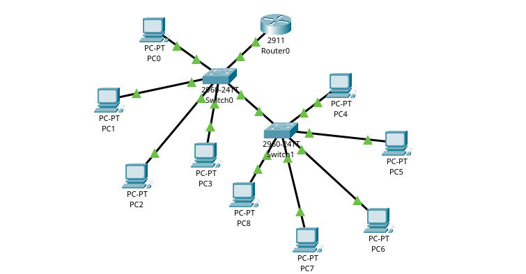
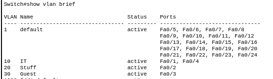
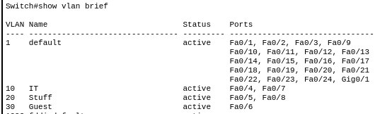
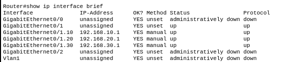
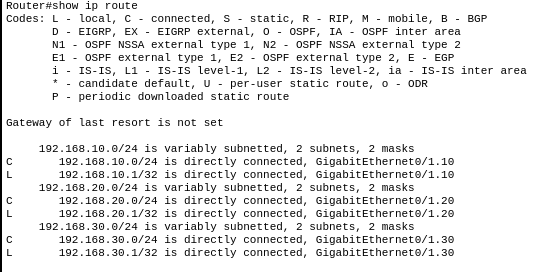
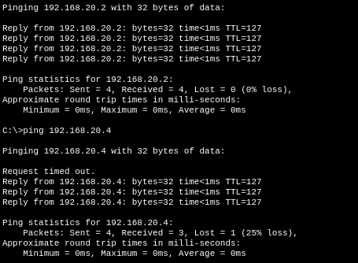
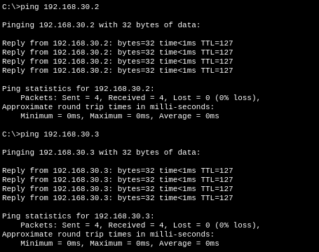

# Inter-VLAN Routing

### Objective
Design and configure a scaled-up network with 3 VLANs across 2 switches in a daisy-chain topology, enable inter-VLAN routing using a Cisco router (router-on-a-stick), and apply an ACL to restrict traffic between VLANs.

### Topology


```
Router0 (Cisco 2911)
└── Switch0 (Cisco 2960) — Core Switch
    ├── PC0, PC1, PC2, PC3 — Access PCs
    └── Switch1 (Cisco 2960) — Access Switch
        └── PC4, PC5, PC6, PC7, PC8 — Access PCs
```

### Devices Used
| Device | Model | Count |
|--------|-------|-------|
| Router | Cisco 2911 | 1 |
| Switch | Cisco 2960 | 2 |
| PC | PC-PT | 9 |

### VLAN Plan
| VLAN | Name | Subnet | Gateway |
|------|------|--------|---------|
| 10 | IT | 192.168.10.0/24 | 192.168.10.1 |
| 20 | Staff | 192.168.20.0/24 | 192.168.20.1 |
| 30 | Guest | 192.168.30.0/24 | 192.168.30.1 |

### IP Address Plan

**Switch0 PCs:**
| Device | VLAN | IP Address | Gateway |
|--------|------|------------|---------|
| PC0 | 10 (IT) | 192.168.10.2 | 192.168.10.1 |
| PC1 | 20 (Staff) | 192.168.20.2 | 192.168.20.1 |
| PC2 | 30 (Guest) | 192.168.30.2 | 192.168.30.1 |
| PC3 | 10 (IT) | 192.168.10.3 | 192.168.10.1 |

**Switch1 PCs:**
| Device | VLAN | IP Address | Gateway |
|--------|------|------------|---------|
| PC4 | 10 (IT) | 192.168.10.4 | 192.168.10.1 |
| PC5 | 20 (Staff) | 192.168.20.3 | 192.168.20.1 |
| PC6 | 30 (Guest) | 192.168.30.3 | 192.168.30.1 |
| PC7 | 10 (IT) | 192.168.10.5 | 192.168.10.1 |
| PC8 | 20 (Staff) | 192.168.20.4 | 192.168.20.1 |

---

### Configuration Summary

**Switch0 — VLAN & Port Assignment:**
- Fa0/1 → VLAN 10 (IT) — access mode
- Fa0/2 → VLAN 20 (Staff) — access mode
- Fa0/3 → VLAN 30 (Guest) — access mode
- Fa0/4 → VLAN 10 (IT) — access mode
- Gig0/1 → Router — trunk mode
- Gig0/2 → Switch1 — trunk mode



**Switch1 — VLAN & Port Assignment:**
- Fa0/4 → VLAN 10 (IT) — access mode
- Fa0/5 → VLAN 20 (Staff) — access mode
- Fa0/6 → VLAN 30 (Guest) — access mode
- Fa0/7 → VLAN 10 (IT) — access mode
- Fa0/8 → VLAN 20 (Staff) — access mode
- Gig0/2 → Switch0 — trunk mode



**Router — Router-on-a-Stick (subinterfaces on Gig0/1):**
- Gig0/1.10 → 192.168.10.1 — gateway for VLAN 10
- Gig0/1.20 → 192.168.20.1 — gateway for VLAN 20
- Gig0/1.30 → 192.168.30.1 — gateway for VLAN 30





**ACL — Guest VLAN restriction:**
```cisco
access-list 100 deny ip 192.168.30.0 0.0.0.255 192.168.10.0 0.0.0.255
access-list 100 permit ip any any
interface gig0/1.30
ip access-group 100 in
```

> **Note:** Standard ACLs with ICMP (ping) cause bidirectional blocking because ICMP is stateless — the router cannot distinguish between a new request and a reply. In a production environment this would be handled with reflexive ACLs or a stateful firewall. This is a known limitation documented here for learning purposes.

---

### Test Results
| Test | From | To | Expected | Result |
|------|------|----|----------|--------|
| Same VLAN | PC0 (VLAN 10) | PC3 (VLAN 10) | Reachable | ✅ Pass |
| Same VLAN across switches | PC0 (VLAN 10) | PC4 (VLAN 10) | Reachable | ✅ Pass |
| Inter-VLAN | PC0 (VLAN 10) | PC1 (VLAN 20) | Reachable | ✅ Pass |
| Inter-VLAN across switches | PC0 (VLAN 10) | PC5 (VLAN 20) | Reachable | ✅ Pass |
| Inter-VLAN | PC0 (VLAN 10) | PC2 (VLAN 30) | Reachable | ✅ Pass |





> **Note:** First ping packet drop is normal — this is ARP resolution, where devices discover each other's MAC addresses before communicating. Subsequent pings succeed with 0% loss.

---

### Key Differences from Lab 01
- 2 switches instead of 1 — daisy-chain topology (core + access switch)
- 9 PCs instead of 3
- Switch-to-switch trunk link required to carry all VLANs across both switches
- Same subnets work across both switches because of trunk propagation

*See Lab 01 for the basic single-switch version of this lab.*
